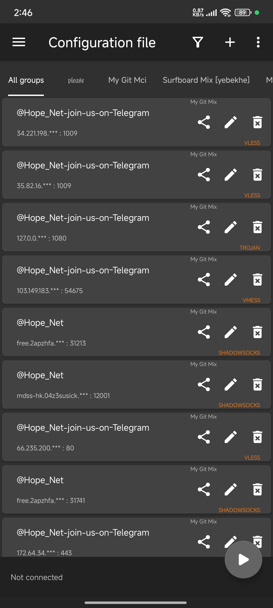

# ✨ V2ray_Sub: V2ray Subscription Management 🔗

[](LICENSE)
[](https://github.com/mehrdadmb2/V2ray_Sub/stargazers)
[](https://github.com/mehrdadmb2/V2ray_Sub/issues)
[](https://github.com/mehrdadmb2/V2ray_Sub/network/members)

**V2ray_Sub** is a tool for managing V2ray subscription links. It automates the process of updating, organizing, and optimizing your subscriptions, ensuring an uninterrupted experience.

---

## 🇮🇷 🌍 لیست اشتراک‌ها | Subscription List

مدیریت اشتراک‌های V2ray با استفاده از لینک‌های زیر:

- **Mix**:
  ```
  https://raw.githubusercontent.com/mehrdadmb2/V2ray_Sub/refs/heads/main/Mix.txt
  ```
- **Irancell**:
  ```
  https://github.com/mehrdadmb2/V2ray_Sub/raw/refs/heads/main/Irancell.txt
  ```
- **MCI**:
  ```
  https://github.com/mehrdadmb2/V2ray_Sub/raw/refs/heads/main/Mci.txt
  ```

## 📌 ویژگی‌ها | Features

- 🔄 **به‌روزرسانی خودکار اشتراک‌ها**
- 🗂 **مدیریت هم‌زمان چندین اشتراک**
- 🛠 **بهینه‌شده برای مصرف کم منابع سیستم**

---

## 🚀 راه‌اندازی اولیه | Getting Started

مراحل زیر را برای استفاده از **V2ray_Sub** دنبال کنید:

### 1️⃣ دانلود و نصب | Download & Install
```bash
 git clone https://github.com/mehrdadmb2/V2ray_Sub.git
 cd V2ray_Sub
```

### 2️⃣ نصب پیش‌نیازها | Install Requirements
```bash
pip install -r requirements.txt
```

### 3️⃣ اجرای برنامه | Run the Program
```bash
python v2ray_sub_manager.py
```

---

## 📲 راهنمای اضافه کردن اشتراک به V2rayNG (اندروید) | Adding Subscription to V2rayNG (Android)

### 1️⃣ **اجرای برنامه V2rayNG | Open V2rayNG**


### 2️⃣ **ورود به منوی اشتراک‌ها | Open Subscription Menu**


### 3️⃣ **افزودن اشتراک جدید | Add a New Subscription**


### 4️⃣ **وارد کردن اطلاعات اشتراک | Enter Subscription Details**
- **نامی برای اشتراک وارد کنید**
- **لینک اشتراک را جای‌گذاری کنید**
- **گزینه Auto Update را فعال کنید**


### 5️⃣ **به‌روزرسانی اشتراک | Update Subscription**


### ✅ **اشتراک شما اضافه شد! | Subscription Added!**


> 💡 **نکته | Note:** همیشه اشتراک‌های خود را به‌روزرسانی کنید تا از سرورهای فعال استفاده کنید.

---

## 🤝 همکاری در پروژه | Contribute to the Project

💡 آیا می‌خواهید **V2ray_Sub** را بهبود دهید؟
1. **مخزن را Fork کنید** و یک شاخه جدید ایجاد کنید.
2. **تغییرات خود را اعمال و تست کنید.**
3. **یک Pull Request ارسال کنید.**

---

## 📝 مجوز | License

این پروژه تحت مجوز **MIT** منتشر شده است. جزئیات بیشتر در فایل [LICENSE](LICENSE) موجود است.

## 📩 ارتباط با ما | Contact Us

📧 **ایمیل:** [game.developer.mb@gmail.com](mailto:game.developer.mb@gmail.com)

🌐 **GitHub:** [mehrdadmb2](https://github.com/mehrdadmb2)

> Developed with ❤️ by [Mehrdad](https://github.com/mehrdadmb2) 👨‍💻

