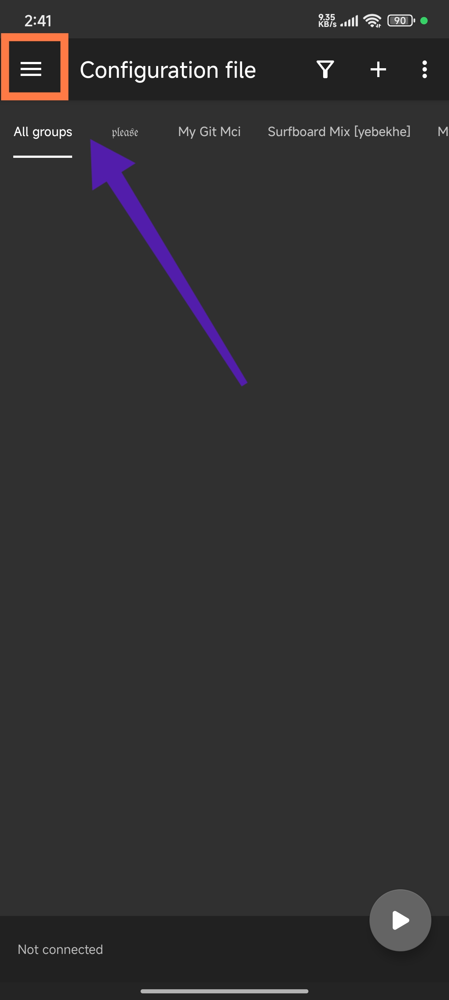
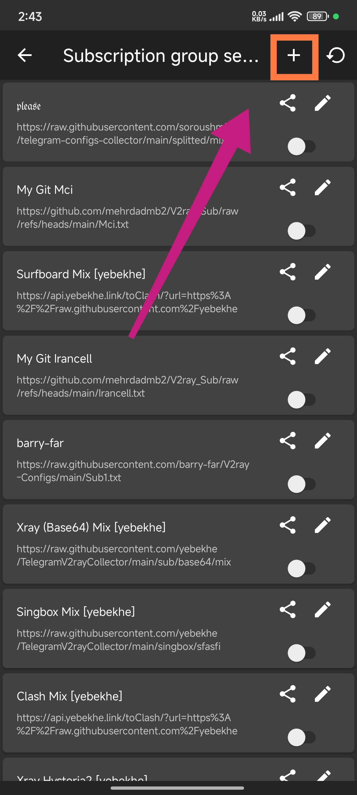
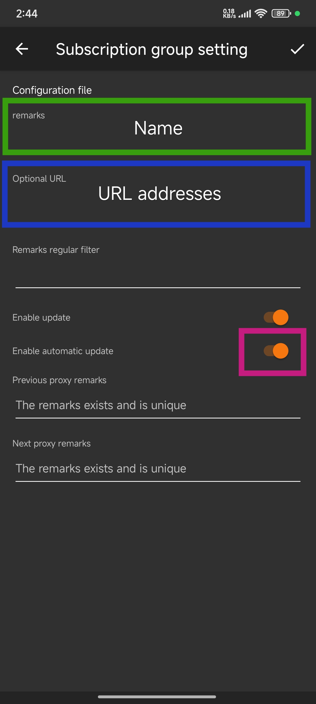
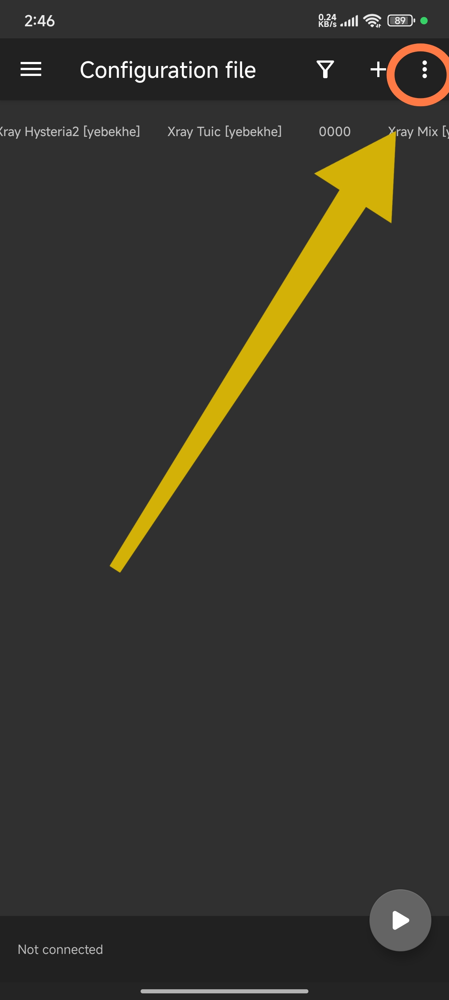
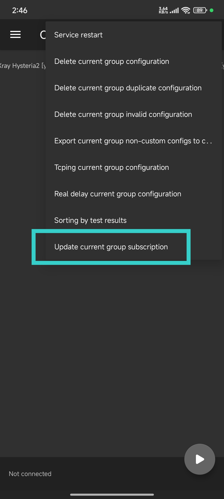

# ✨ V2ray_Sub: V2ray Subscription Manager 🔗

[](LICENSE)
[](https://github.com/mehrdadmb2/V2ray_Sub/stargazers)
[](https://github.com/mehrdadmb2/V2ray_Sub/issues)
[](https://github.com/mehrdadmb2/V2ray_Sub/network/members)

**V2ray_Sub** is a dedicated tool for managing V2ray subscription links with ease. It simplifies the process of keeping your V2ray subscriptions up to date, organized, and optimized for an uninterrupted connection experience.

---

## 🌐 Available Subscriptions

Manage your V2ray connections with the following pre-configured links:

- **Mix** :
  ```
  https://raw.githubusercontent.com/mehrdadmb2/V2ray_Sub/refs/heads/main/Mix.txt
  ```
- **Irancell** :
  ```
  https://github.com/mehrdadmb2/V2ray_Sub/raw/refs/heads/main/Irancell.txt
  ```
- **MCI** :
  ```
  https://github.com/mehrdadmb2/V2ray_Sub/raw/refs/heads/main/Mci.txt
  ```

## 📌 Key Features

- 🔄 **Automatic Subscription Updates**: Keep your V2ray configurations updated without manual effort.
- 🗂 **Subscription Management**: Handle multiple subscriptions seamlessly and switch as needed.
- 🛠️ **Efficient Resource Use**: Optimized for minimal resource consumption while maintaining robust functionality.

## 🚀 Getting Started

To get started with **V2ray_Sub**, follow these steps:

1. **Clone the Repository**:

    ```bash
    git clone https://github.com/mehrdadmb2/V2ray_Sub.git
    cd V2ray_Sub
    ```

2. **Install Dependencies**:

    ```bash
    pip install -r requirements.txt
    ```

3. **Run the Program**:

    ```bash
    python v2ray_sub_manager.py
    ```

## 📚 Usage Instructions

### 📲 Adding Subscription to V2rayNG
If you're using **V2rayNG** on Android, follow these steps to add a new subscription:

1. **Open V2rayNG**: Launch the V2rayNG application on your device.
   

2. **Access Subscription Menu**: Tap on the "Subscribe" option in the menu.
   

3. **Add New Subscription**: Click on the `+` icon at the top left corner to add a new subscription.
   

4. **Enter Subscription Details**:
   - Enter a custom name for the subscription.
   - Paste the subscription link from the list above.
   - Enable the "Auto Update" option for automatic updates.
   - Save the settings.
   

5. **Update Subscription**:
   - Click on the three dots at the top right corner.
   
   - Select "Update Subscription".
   

6. **Subscription Added**: Your new subscription links will be automatically imported and ready to use.
   

> **Note**: Make sure your dependencies are updated regularly for the best performance.

## 🤝 Contributing

Want to help make **V2ray_Sub** better? Contributions are welcome!

1. Fork the repository and create a new branch.
2. Make your changes, test thoroughly, and submit a pull request.
3. Be sure to include a detailed description of your changes.

## 📝 License

This project is licensed under the MIT License - see the [LICENSE](LICENSE) file for details.

## 📩 Contact

For any questions or suggestions, feel free to reach out:

- **Email**: [game.developer.mb@gmail.com](mailto:game.developer.mb@gmail.com)
- **GitHub**: [mehrdadmb2](https://github.com/mehrdadmb2)

---

> Created with ❤️ by [Mehrdad](https://github.com/mehrdadmb2) 👨‍💻

