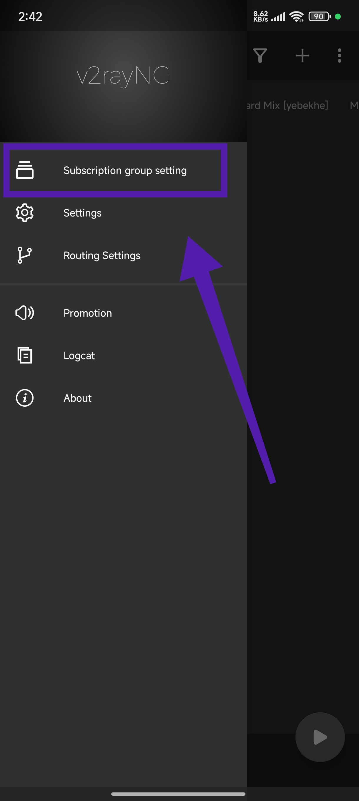

# ✨ V2ray_Sub: مدیریت اشتراک‌های V2ray 🔗

[](LICENSE)
[](https://github.com/mehrdadmb2/V2ray_Sub/stargazers)
[](https://github.com/mehrdadmb2/V2ray_Sub/issues)
[](https://github.com/mehrdadmb2/V2ray_Sub/network/members)

**V2ray_Sub** ابزاری برای مدیریت لینک‌های اشتراک V2ray است. این ابزار روند به‌روزرسانی، سازماندهی و بهینه‌سازی اشتراک‌های شما را خودکار کرده و تجربه‌ای بدون قطعی را ارائه می‌دهد.

---

## 🌍 لیست اشتراک‌ها

برای مدیریت اتصالات V2ray خود می‌توانید از لینک‌های زیر استفاده کنید:

- **Mix**:
  ```
  https://raw.githubusercontent.com/mehrdadmb2/V2ray_Sub/refs/heads/main/Mix.txt
  ```
- **Irancell**:
  ```
  https://github.com/mehrdadmb2/V2ray_Sub/raw/refs/heads/main/Irancell.txt
  ```
- **MCI**:
  ```
  https://github.com/mehrdadmb2/V2ray_Sub/raw/refs/heads/main/Mci.txt
  ```

## 📌 ویژگی‌ها

- 🔄 **به‌روزرسانی خودکار اشتراک‌ها**
- 🗂 **مدیریت چندین اشتراک به‌صورت همزمان**
- 🛠 **بهینه برای مصرف کم منابع سیستم**

---

## 🚀 راه‌اندازی اولیه

برای استفاده از **V2ray_Sub**، مراحل زیر را دنبال کنید:

### 1️⃣ دانلود و نصب 
```bash
 git clone https://github.com/mehrdadmb2/V2ray_Sub.git
 cd V2ray_Sub
```

### 2️⃣ نصب پیش‌نیازها
```bash
pip install -r requirements.txt
```

### 3️⃣ اجرای برنامه
```bash
python v2ray_sub_manager.py
```

---

## 📲 راهنمای اضافه کردن اشتراک به V2rayNG (اندروید)

### 1️⃣ **اجرای برنامه V2rayNG**
برنامه **V2rayNG** را باز کنید.
[](Pic/Screenshot_2025-02-27-14-41-55-096_com.v2ray.ang.jpg)

### 2️⃣ **ورود به منوی اشتراک‌ها**
روی گزینه "Subscribe" کلیک کنید.
[](Pic/Screenshot_2025-02-27-14-42-51-665_com.v2ray.ang.jpg)

### 3️⃣ **افزودن اشتراک جدید**
روی آیکون `+` کلیک کنید.
[](Pic/Screenshot_2025-02-27-14-43-25-782_com.v2ray.ang.jpg)

### 4️⃣ **وارد کردن اطلاعات اشتراک**
- یک نام برای اشتراک بنویسید.
- لینک اشتراک را وارد کنید.
- گزینه **Auto Update** را فعال کنید.
[](Pic/Screenshot_2025-02-27-14-44-08-341_com.v2ray.ang.jpg)

### 5️⃣ **به‌روزرسانی اشتراک**
روی سه نقطه بالا کلیک کرده و "Update Subscription" را انتخاب کنید.
[](Pic/Screenshot_2025-02-27-14-46-29-900_com.v2ray.ang.jpg)

### ✅ **اشتراک شما اضافه شد!**
[](Pic/Screenshot_2025-02-27-14-46-54-915_com.v2ray.ang.jpg)

> 💡 **نکته:** همواره اشتراک‌های خود را به‌روزرسانی کنید تا از سرورهای فعال بهره ببرید.

---

## 🤝 همکاری در پروژه

💡 علاقه‌مند به بهبود **V2ray_Sub** هستید؟
1. ریپازیتوری را فورک کنید و شاخه جدیدی ایجاد کنید.
2. تغییرات خود را اعمال کرده و تست کنید.
3. درخواست **Pull Request** ارسال کنید.

---

## 📝 مجوز

این پروژه تحت مجوز **MIT** منتشر شده است. برای اطلاعات بیشتر فایل [LICENSE](LICENSE) را بررسی کنید.

## 📩 ارتباط با ما

📧 **ایمیل:** [game.developer.mb@gmail.com](mailto:game.developer.mb@gmail.com)

🌐 **گیت‌هاب:** [mehrdadmb2](https://github.com/mehrdadmb2)

> ایجاد شده با ❤️ توسط [Mehrdad](https://github.com/mehrdadmb2) 👨‍💻
